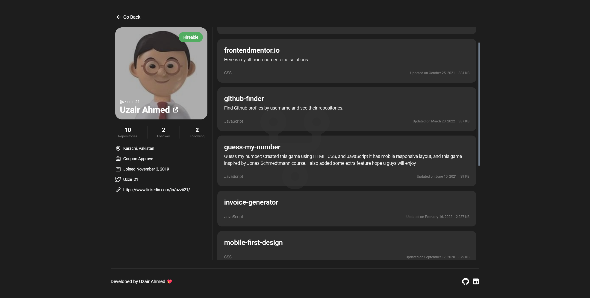

# github-finder
 
Find Github profiles by username and see their repositories.

[**Live Demo**](https://github-finder-uzzii-21.vercel.app/) 



Built with:

- [React.js](https://reactjs.org/)
- [Tailwindcss](https://tailwindcss.com/)
- [daisyUI](https://daisyui.com/)

## Getting Started

1. Install dependencies

   ```bash
   yarn
   ```

2. Fire up the server and watch files

   ```bash
   yarn dev
   ```

## Build

1. Build

   ```bash
   yarn build
   ```

2. Build preview!

   ```bash
   yarn preview
   ```
